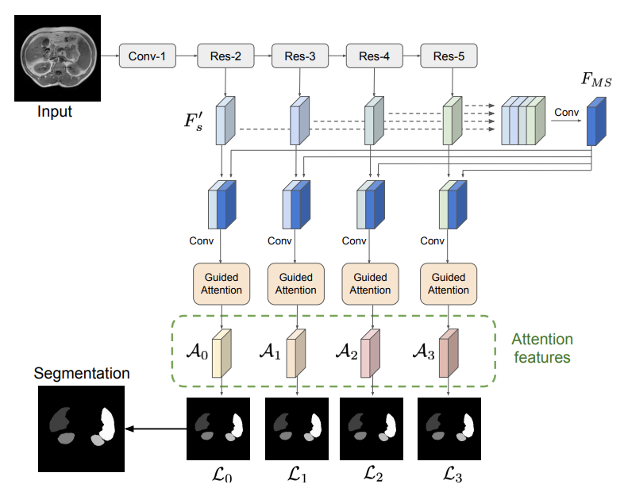
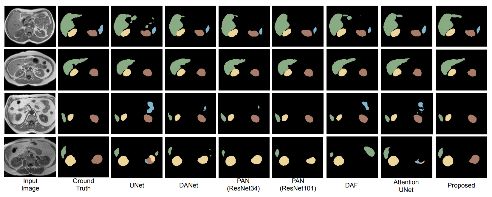

# Medical Image Segmentation 
This project improves medical image segmentation by integrating guided self-attention into CNNs, enhancing feature selection and long-range dependencies. Using an MRI-based dataset, a U-Net transformer-based model is trained with dice loss and evaluated using DSC and IoU metrics. The approach outperforms standard models, achieving higher accuracy and lower variance, making it valuable for automated medical diagnosis. 

Despite the advancements in medical image segmentation with CNNs, standard models face challenges such as redundant multi-scale feature extraction in encoder-decoder architectures and inefficient long-range dependency modeling, leading to suboptimal feature representations. To address this, the inclusion of guided self-attention mechanisms to enhance contextual dependencies and adaptively highlight relevant features. An additional loss mechanism further refines attention, ensuring focus on discriminative regions while suppressing irrelevant information. Evaluated on abdominal organ segmentation in MRI, the model outperforms, improving accuracy and consistency, demonstrating its potential for precise and reliable automatic segmentation in medical imaging

## Design of the Proposed Model


## Results


## Requirements

- The code has been written in Python (3.6) and requires [pyTorch](https://pytorch.org) (version 1.1.0)
- Install the dependencies using `pip install -r requirements.txt`

## Preparing your data
You have to split your data into three folders: train/val/test. Each folder will contain two sub-folders: Img and GT, which contain the png files for the images and their corresponding ground truths. The naming of these images is important, as the code to save the results temporarily to compute the 3D DSC, for example, is sensitive to their names.

Specifically, the convention to follow for the names is as follows:
- Subj_Xslice_Y.png where X indicates the subject number (or ID) and Y is the slice number within the whole volume. (Do not use 0 padding for numbers, i.e., the first slice should be 1 and not 01)
- The corresponding mask must be named in the same way as the image.

An example of a sample image is added in [dataset](https://github.com/rahulkulkarny/Medical-Image-Segmentation/tree/main/DataSetSample/train)

## Running the code

Note: Set the data path appropriately in `src/main.py` before running the code.

To run the code you simply need to use the following script:

```
bash train.sh
```


